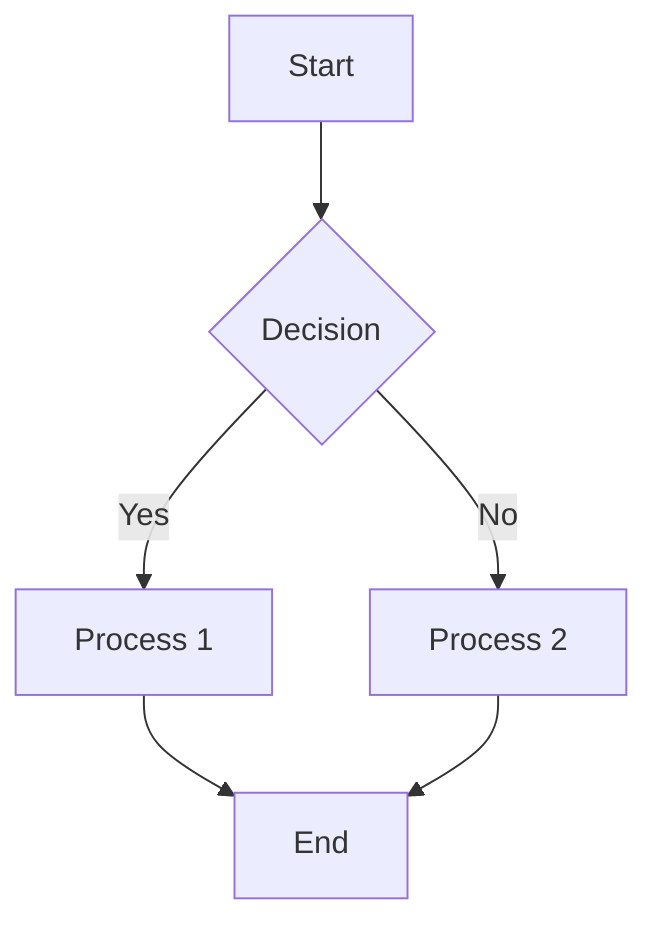

The mermaid shortcode is an extension of [syntax-highlighting](./syntax-highlighting.md). If you provide `mermaid` as your syntax option for a code fence, it will attempt to actually render the Mermaid diagram.


```
``` mermaid
<your mermaid syntax>


```
## Grid

Mermaid supports multiple grid sizes, similar to the [img](./images.md) shortcode.

- `first-two-thirds` (default)
- `wide`
- `last-third`
- `first-third`

This attribute is provided as part of the codeblock options for `mermaid`.

### Default
By default, it will use the `first-two-thirds` grid, if nothing is provided. 

This allows the use of a side callout.

```
```mermaid
graph TD
    A[Start] --> B{Decision};
    B -->|Yes| C[Process 1];
    B -->|No| D[Process 2];
    C --> E[End];
    D --> E;

# ```


Here is an example of a callout to the side of a mermaid chart.

```



Here is an example of a callout to the side of a mermaid chart.



### Wide
To use the full, wide grid:
```
```mermaid {grid="wide"}

```


```mermaid {grid="wide"}
graph LR
    %% Nodes and Relationships
    subgraph KubernetesCluster["Kubernetes Cluster"]
        subgraph NamespaceNGF["Namespace: nginx-gateway"]
            NGFControlPlanePod["NGINX Gateway Fabric Control Plane Pod"]
            NGFControlPlanePod --> KubernetesAPI["Kubernetes API"]
        end
        subgraph ApplicationsNamespaceA["Namespace: applications"]
            subgraph DataplaneComponentsA["Dataplane Components"]
                GatewayA["Gateway A<br>Listener: *.example.com"]
                subgraph NGINXDataPlanePodA["NGINX Data Plane Pod"]
                    subgraph NGINXContainerA["NGINX Container"]
                        NGINXProcessA["NGINX Process"]
                        NGINXAgentA["NGINX Agent"]
                    end
                end
            end
            subgraph HTTPRouteAAndApplications["HTTPRoutes and Applications"]
                HTTPRouteA["HTTPRoute A<br>Host: a.example.com"]
                HTTPRouteB["HTTPRoute B<br>Host: b.example.com"]
                ApplicationA["Application A<br>Pods: 2"]
                ApplicationB["Application B<br>Pods: 1"]
            end
        end
        subgraph ApplicationsNamespaceB["Namespace: applications-2"]
            subgraph DataplaneComponentsB["Dataplane Components"]
                GatewayB["Gateway B<br>Listener: *.other-example.com"]
                subgraph NGINXDataPlanePodB["NGINX Data Plane Pod"]
                    subgraph NGINXContainerB["NGINX Container"]
                        NGINXProcessB["NGINX Process"]
                        NGINXAgentB["NGINX Agent"]
                    end
                end
            end
            subgraph HTTPRouteBandApplications["HTTPRoutes and Applications"]
                HTTPRouteC["HTTPRoute C<br>Host: c.other-example.com"]
                ApplicationC["Application C<br>Pods: 1"]
            end
        end
    end
    subgraph UsersAndClients["Users and Clients"]
        UserOperator["Cluster Operator"]
        UserDevA["Application Developer A"]
        UserDevB["Application Developer B"]
        ClientA["Client A"]
        ClientB["Client B"]
    end
    subgraph SharedInfrastructure["Public Endpoint"]
        PublicEndpoint["TCP Load Balancer / NodePort"]
    end
    %% Updated Traffic Flow
    ClientA-->|a.example.com|PublicEndpoint
    ClientB-->|c.other-example.com|PublicEndpoint
    PublicEndpoint==>NGINXProcessA
    PublicEndpoint==>NGINXProcessB
    NGINXProcessA==>ApplicationA
    NGINXProcessA==>ApplicationB
    NGINXProcessB==>ApplicationC
    %% Kubernetes Configuration Flow
    HTTPRouteA-->GatewayA
    HTTPRouteB-->GatewayA
    HTTPRouteC-->GatewayB
    UserOperator-->KubernetesAPI
    NGFControlPlanePod--gRPC-->NGINXAgentA
    NGFControlPlanePod--gRPC-->NGINXAgentB
    NGINXAgentA-->NGINXProcessA
    NGINXAgentB-->NGINXProcessB
    UserDevA-->KubernetesAPI
    UserDevB-->KubernetesAPI
    %% Styling
    style UserOperator fill:#66CDAA,stroke:#333,stroke-width:2px
    style GatewayA fill:#66CDAA,stroke:#333,stroke-width:2px
    style GatewayB fill:#66CDAA,stroke:#333,stroke-width:2px
    style NGFControlPlanePod fill:#66CDAA,stroke:#333,stroke-width:2px
    style NGINXProcessA fill:#66CDAA,stroke:#333,stroke-width:2px
    style NGINXProcessB fill:#66CDAA,stroke:#333,stroke-width:2px
    style KubernetesAPI fill:#9370DB,stroke:#333,stroke-width:2px
    style HTTPRouteAAndApplications fill:#E0FFFF,stroke:#333,stroke-width:2px
    style HTTPRouteBandApplications fill:#E0FFFF,stroke:#333,stroke-width:2px
    style UserDevA fill:#FFA07A,stroke:#333,stroke-width:2px
    style HTTPRouteA fill:#FFA07A,stroke:#333,stroke-width:2px
    style HTTPRouteB fill:#FFA07A,stroke:#333,stroke-width:2px
    style ApplicationA fill:#FFA07A,stroke:#333,stroke-width:2px
    style ApplicationB fill:#FFA07A,stroke:#333,stroke-width:2px
    style ClientA fill:#FFA07A,stroke:#333,stroke-width:2px
    style UserDevB fill:#87CEEB,stroke:#333,stroke-width:2px
    style HTTPRouteC fill:#87CEEB,stroke:#333,stroke-width:2px
    style ApplicationC fill:#87CEEB,stroke:#333,stroke-width:2px
    style ClientB fill:#87CEEB,stroke:#333,stroke-width:2px
    style PublicEndpoint fill:#FFD700,stroke:#333,stroke-width:2px
```

### Last third
Or an 'aside' style `last-third`:
```
```mermaid {grid="last-third"}

```

Some content on the left, where the graph would appear to the right.
For this use case, you would want to make sure your text is similar height, or higher than the graph, or the document flow will look off.
```mermaid {grid="last-third"}
graph TD
    A[Start] --> B{Decision};
    B -->|Yes| C[Process 1];
    B -->|No| D[Process 2];
    C --> E[End];
    D --> E;
```


